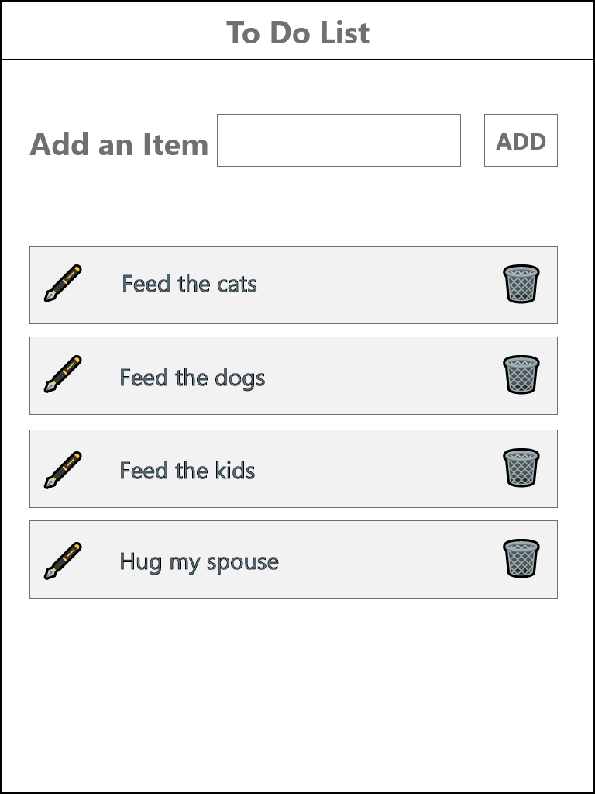

# Todo (Front-end Developer Finishing Academy)

### Table of Contents

1. Project Demo Link
2. Purpose
3. Motivation
4. Wireframes
5. Technologies Used

### Project Demo Link: [Front-end Developer Finishing Academy Todo app](https://frontend-developer-finishing-academy-todo.netlify.app/)

### Purpose:

A basic CRUD Todo project that allowed a user to add, delete, update, and edit user inputted activities.

### Motivation:

This is the first in a series of 8 front-end focus projects for the Front-end Developer Finishing Academy. This todo web application was developed while writing three blog posts to act as a navigator to aspiring developers developing their own. 
1. [Todo project Planning Guide](https://dev.to/jcsmileyjr/todo-project-planning-guide-5gl5)
2. Todo project Development Guide (coming soon)
3. Todo project Adding the Extras (coming soon)

### WireFrames

### This app was built with the following technologies:

**React:** JavaScript front-end library for building user interfaces

**Netlify**: Web developer platform for hosting infrastructure, continuous integration, deployment pipeline with GitHub, and serverless backend services.

**Git-Hub:** Web-based version control repository and Internet hosting service

**Abode XD** A wire-framing tool used to create a mockup/visual of what is to be coded

**JavaScript:** Object-oriented programming language for web pages

**HTML:** Mark-up language for creating web pages

**CSS:** A formatting language for styling web pages

_Created by [JC Smiley](https://www.linkedin.com/in/jcsmileyjr/) in July of 2021_
